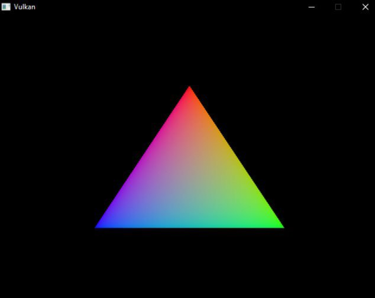

# What's that?

**This is my own take on the code from the Vulkan Tutorial. It's not a unique project or design — it's simply my vision of the potential structure of a good Vulkan program.**

- Feel free to criticize any part of the program.

- Nothing prevents you from using any of the ideas.

- Give it a star if you like it! :)

# Screenshot!

**Now the program can draw a multi-colored triangle! :DDD**



# How to build?

**It's not difficult! But if you have a weak computer, you'll have to be patient.**

## Clone the repository

### Archlinux:
- Install using pacman: ````sudo pacman -S git````

### Windows:
- Git download page: [git](https://git-scm.com/install/windows)


### Clone: 
- ````git clone --recurse-submodules https://github.com/moderneus/Vulkan````

## Install the required dependencies

### Archlinux:
  
  - ````sudo pacman -S vulkan-devel````

  - ```sudo pacman -S shaderc```
  
  - ````sudo pacman -S cmake````
  
  - ````sudo pacman -S clang````
### Windows:
- [Vulkan SDK](https://vulkan.lunarg.com/sdk/home)
- [CMake](https://cmake.org/download/)
- [Clang](https://releases.llvm.org/download.html)

## Build Environment

### Archlinux:
- You have everything ready, you can start building!
### Windows: 
- be sure to add the dependency bin folders to the global PATH variable!

## Building!
**The commands are identical between the two operating systems, the only difference being that Windows uses a backslash.**
- Commands:

      glslc -O code/shaders/vert/VertexShader.vert -o code/shaders/vert/VertexShader.spv
      glslc -O code/shaders/frag/FragmentShader.frag -o code/shaders/frag/FragmentShader.spv
      mkdir code/build
      cd code/build
      cmake ..
      cmake --build .

**The assembly process has started, please wait for a while.**

## Run it!
**You'll get an executable file — run it and enjoy the triangle! :)**

# Author
**The only one: [moderneus](https://github.com/moderneus)**
